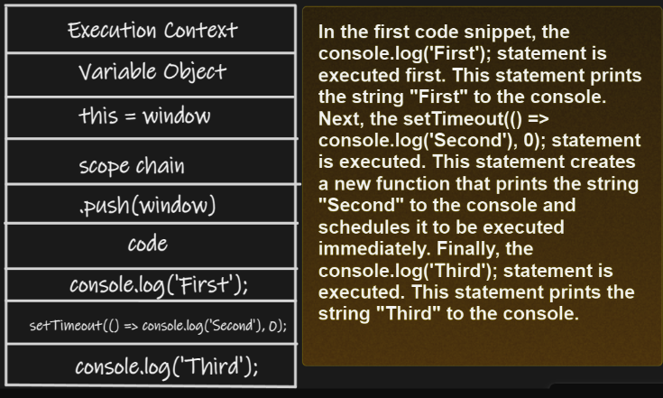
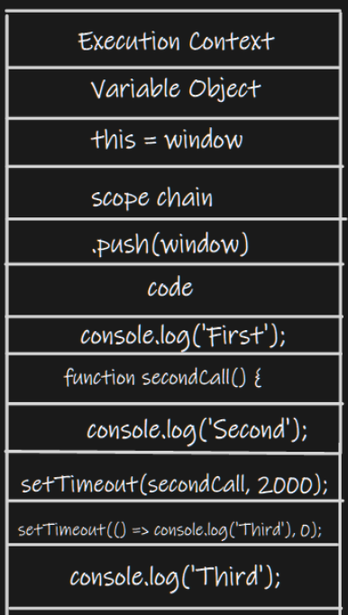

# 🌟 Everything in JavaScript happens inside execution context

```
The execution context is like a big box in which we have 2 components in it.
```

🧠 Memory Component: The firt component inside javascript is memory component. The memory component is also known as variable environment.

1.1: In Memory environment the codes variables are stored as the key value pair. Even functions are stored as the key value pair.
For example:

```Javascript
a: 10
function: {...}
```

⚙️ Code Component: The second component inside execution context is code component. The code component is also known as thread of execution.

2.2: The thread of execution is responsible for the running of code one line at a time. In a sequence.

## 🌟 Javascript can also be defined as a synchronus single-threaded language.

In which

1. Single Threaded means one command at a time.

2. Synchronous means in a specific order.

---

## 🔮 The execution context diagram shows the different stages of execution for each code snippet.

✨ Creation of the Context: The first stage is the creation of the execution context. This includes creating the variable object, setting the value of the this keyword, and creating the scope chain.
🌟 Code's Grand Performance: The second stage is the execution of the code. This includes executing the statements and expressions in the script and evaluating any function calls.
🔥 Context's Farewell: The third stage is the destruction of the execution context. This includes destroying the variable object and scope chain.

👉🏻Execution context diagram👉🏻

🎭 Code Snippet 1: The Enchanted Timers

```Javascript
console.log('First');
setTimeout(() => console.log('Second'), 0);
console.log('Third');
```



---

🎭 Code Snippet 2:

```Javascript
console.log('First');
function secondCall() {
console.log('Second');
}
setTimeout(secondCall, 2000);
setTimeout(() => console.log('Third'), 0);
console.log('Third');
```



- In the second code snippet, the console.log('First'); statement is executed first.
- This statement prints the string "First" to the console. Next, the function secondCall() { console.log('Second'); } statement is executed.
- This statement defines a new function named secondCall that prints the string "Second" to the console. Next, the setTimeout(secondCall, 2000); statement is executed.
- This statement schedules the secondCall function to be executed after 2000 milliseconds. Finally, the console.log('Third'); statement is executed. This statement prints the string "Third" to the console.

---

# 🪄 Phases of execution context:

In the grand symphony of execution context, we witness two mesmerizing phases:

🌌 Memory Creation Phase: The first phase is memory creation phase. or CREATION PHASE. This is very critical phase. 2. The second phase is code executn phase.

🔥 Code Execution Phase:
In this phase javascript will allocate the memory to all the variables and functions. It will allocate the memory by reserving a space in the memory for the variables and functions.

Note: The memory defining the variables will be `undefined` in the first phase. And in the case of functions it stores the whole code inside this memory space.

# Code Execution Phase:

In this phase the variables actual value are now assigned to the undefined varibale. And functions were left as it is.

Note: Now as in function we encounter function envocation, we use another execution context inside the pre existed execution context. Which also have a memory and a code component. And again we will have the same procedure until the function will not through all the output.

When the whole function will get executed the new created execution context will be deleted and we get back to out Global execution context.

And after the execution of entire program the javascript finishes its work and deletes the Global Execution Context.

# ⚡️But how JS is able to manage such a complex task?

🎶 Well, for this, JavaScript manages a stack. Which is also known as Call Stack.
In the bottom of the stack we have our Global execution context. Whenever javascript is assigned work, the whole execution context is pushed inside the stack.

- Whenever the function is invoked or a new execution context is created, it also get pushed inside the Call Stack. When the new added Execution context is done with its work, it got pop out and the control goes back to the Global Execution Context(GEC) again.

This procedure keeps going untill all execution contexts are finished. And with the end of GEC; call stack also gets empty.

So by this we can say,

```
Call stack maintains the order of execution of execution contexts
```

🎉

# Question:

What do you call a JavaScript execution context that's always running?

A **thread**mill! 😂
